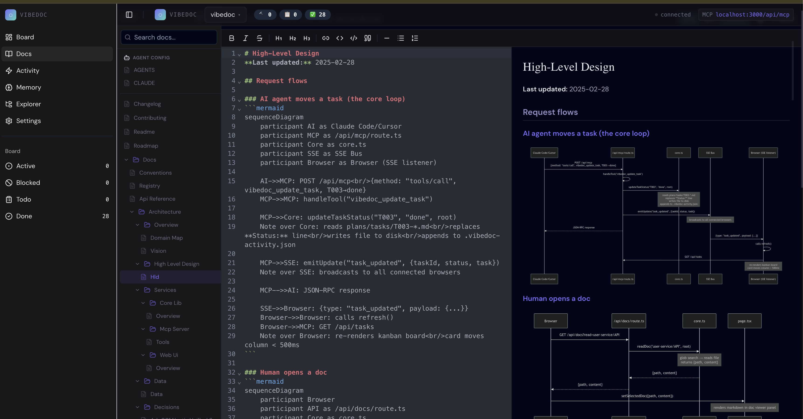

# VibeDoc

**Local-first project intelligence for AI-assisted development.**

[](https://www.npmjs.com/package/vibedoc)
[](https://nodejs.org)
[](./LICENSE)
[](https://github.com/quanghoangf/vibedoc/actions/workflows/ci.yml)

A kanban board + docs viewer + MCP server — all in one process, zero config.  
Point your AI agent at it. Watch tasks move in real time.


```
http://localhost:<port>         ← your browser (kanban, docs, activity, memory, explorer)
http://localhost:<port>/api/mcp ← AI agent connects here via MCP
```

**Why VibeDoc?** Most AI coding sessions lose context between chats. VibeDoc gives your agent a persistent home: it reads tasks from markdown files, writes decisions as ADRs, and updates a memory file at session end — so the next agent picks up exactly where the last one left off. The browser UI lets you watch everything happen live.

---

## Quick start

```bash
cd your-project
npx vibedoc
```

VibeDoc picks a free port automatically and opens the setup page in your browser.  
The port is printed in the terminal — use it when configuring your AI agent.

### Options

```bash
# Pin to a specific port
npx vibedoc --port 3333

# Point at a different project
VIBEDOC_ROOT=/path/to/project npx vibedoc
```

---

## What you get

- **Kanban board** — tasks live in `plans/tasks/*.md`, rendered as draggable cards
- **Docs viewer** — browse and edit every markdown file in `docs/`
- **Live activity feed** — every AI action appears instantly via SSE, no polling
- **Memory tab** — persistent `MEMORY.md` for session handoffs between AI agents
- **File explorer** — treemap/tree/heatmap views of your docs with AI-generated descriptions
- **Roadmap** — a roadmap.sh-style map of `plans/roadmap/*.md`: horizons on a spine, features branching off with status badges; drag nodes, edit inline
- **Plan from the chat** — ask the agent sidebar to plan a roadmap or break an epic into tasks; it asks questions, shows the plan, and writes nothing until you accept
- **MCP server** — 30 tools your AI agent can call to read docs, move tasks, write ADRs, and more

---

## Connect your AI agent

### Claude Code (`~/.claude/claude_desktop_config.json`)

```json
{
  "mcpServers": {
    "vibedoc": {
      "url": "http://localhost:<port>/api/mcp"
    }
  }
}
```

### Cursor (`.cursor/mcp.json` in project root)

```json
{
  "mcpServers": {
    "vibedoc": {
      "url": "http://localhost:<port>/api/mcp"
    }
  }
}
```

### Windsurf (`~/.codeium/windsurf/mcp_config.json`)

```json
{
  "mcpServers": {
    "vibedoc": {
      "url": "http://localhost:<port>/api/mcp"
    }
  }
}
```

> The port is shown in the terminal when VibeDoc starts. Use `--port` to pin it.

---

## MCP tools

30 tools your AI agent can call, grouped by category.

### Session & status

| Tool                    | Effect                                                           |
| ----------------------- | ---------------------------------------------------------------- |
| `vibedoc_read_memory`   | Read `MEMORY.md` — triggers "session start" in the activity feed |
| `vibedoc_update_memory` | Write end-of-session summary and handoff note                    |
| `vibedoc_get_status`    | Board snapshot — active tasks, blockers, doc count               |
| `vibedoc_get_sessions`  | Recent sessions: who, when, tasks moved, docs changed, ADRs      |

### Tasks

| Tool                  | Effect                                                  |
| --------------------- | ------------------------------------------------------- |
| `vibedoc_list_tasks`  | Full kanban board, filterable by status                 |
| `vibedoc_get_task`    | Read a specific task with scope and acceptance criteria |
| `vibedoc_update_task` | Move task status → **you see it live in the browser**   |
| `vibedoc_next_task`   | Claim the next ready task of an epic (deps done) → in-progress |

### Docs

| Tool                     | Effect                                 |
| ------------------------ | -------------------------------------- |
| `vibedoc_list_docs`      | Discover all docs grouped by section   |
| `vibedoc_read_doc`       | Load any doc by name + shows backlinks |
| `vibedoc_search_docs`    | Full-text search across all docs       |
| `vibedoc_write_doc`      | Write or overwrite a doc file          |
| `vibedoc_create_doc`     | Create a doc from a template           |
| `vibedoc_append_doc`     | Append content to an existing doc      |
| `vibedoc_rename_doc`     | Move or rename a doc                   |
| `vibedoc_delete_doc`     | Delete a doc                           |
| `vibedoc_list_templates` | List available doc templates with IDs  |
| `vibedoc_propose_edit`   | Propose edits as a diff; the user accepts or rejects in the UI |

### Context & registry

| Tool                       | Effect                                                      |
| -------------------------- | ----------------------------------------------------------- |
| `vibedoc_get_context`      | Bundle multiple docs into a single context block            |
| `vibedoc_get_file_map`     | Structured map of all docs with descriptions and dates      |
| `vibedoc_read_registry`    | Read `docs/REGISTRY.md` — file tree + annotations           |
| `vibedoc_rebuild_registry` | Regenerate `REGISTRY.md` after adding or removing docs      |
| `vibedoc_annotate_doc`     | Update description and keywords for one doc in the registry |

### Decisions

| Tool                   | Effect                                         |
| ---------------------- | ---------------------------------------------- |
| `vibedoc_log_decision` | Write a new Architecture Decision Record (ADR) |

### Roadmap

| Tool                          | Effect                                                     |
| ----------------------------- | ---------------------------------------------------------- |
| `vibedoc_get_roadmap`         | Horizons with nested features, statuses, and linked tasks  |
| `vibedoc_create_roadmap_item` | Create a horizon or a feature under a horizon              |
| `vibedoc_update_roadmap_item` | Change title, parent, status, order, tasks, or body        |

### Planning (chat sidebar)

| Tool                         | Effect                                                                 |
| ---------------------------- | ---------------------------------------------------------------------- |
| `vibedoc_get_planning_guide` | Load the steps for planning a roadmap or breaking down an epic         |
| `vibedoc_ask_questions`      | Show 1–4 multiple-choice questions as a card; answers come next turn   |
| `vibedoc_propose_plan`       | Propose tasks or horizons/epics; the user unchecks and accepts in the UI |

None of the planning tools write files. Accept in the UI writes the plan. See [Planning from chat](docs/architecture/mcp-tools.md#planning-from-chat).

---

## Recommended CLAUDE.md snippet

Add this to your project's `CLAUDE.md` to guide your AI agent:

```markdown
## Session protocol

**Start of session:**

1. Call `vibedoc_read_memory` — read handoff from last session
2. Call `vibedoc_get_status` — check what's active and blocked

**Before working on a task:**

- Call `vibedoc_get_task <id>` — read full spec and acceptance criteria
- Call `vibedoc_update_task <id> in-progress`
- Working through an epic? Call `vibedoc_next_task { epic: "R037" }` instead — it claims the next ready task; repeat after marking it done

**When making architectural decisions:**

- Call `vibedoc_log_decision` — record it as an ADR

**End of session:**

- Call `vibedoc_update_task` for each task touched
- Call `vibedoc_update_memory` with full summary and handoff note
```

---

## Project structure

VibeDoc reads from your project directory. None of these files are required — VibeDoc shows what it finds.

```
your-project/
├── CLAUDE.md                     ← agent instructions
├── docs/
│   ├── architecture/
│   │   ├── 01-overview/
│   │   ├── 02-high-level-design/
│   │   │   └── HLD.md
│   │   ├── 03-services/
│   │   │   └── user-service/
│   │   │       ├── OVERVIEW.md
│   │   │       ├── API.md
│   │   │       └── EVENTS.md
│   │   └── decisions/
│   │       └── ADR-001-*.md
│   └── REGISTRY.md               ← auto-generated file index
├── plans/tasks/
│   ├── T001-scaffold.md          ← **Status:** 📋 Ready
│   └── T002-auth.md
└── memory/
    └── MEMORY.md
```

---

## Multi-project

VibeDoc auto-discovers sibling directories that contain `CLAUDE.md` or `docs/architecture/`.  
Switch between projects using the dropdown in the top bar.

---

## Activity log

Every AI and human action is appended to `.vibedoc-activity.json` in your project root (last 2000 events are kept).

The Activity tab opens on **Sessions**: one card per agent or human session with who, when, how long, a headline (`3 tasks moved (2 done) · 2 docs changed · 1 ADR`) and clickable task, doc and ADR chips. Expand a card to see its raw events; **All events** shows the flat feed. Both update live via SSE.

A session is the events one actor makes without a 30-minute break, and `vibedoc_read_memory` (session start) always opens a new one. From a task's detail panel, the **Sessions** list shows every session that moved the task and jumps to that card in the Activity tab. Agents read the same timeline with `vibedoc_get_sessions`.

---

## Development

```bash
git clone https://github.com/quanghoangf/vibedoc.git
cd vibedoc
pnpm install
VIBEDOC_ROOT=/path/to/test-project pnpm dev
```

See [CONTRIBUTING.md](./CONTRIBUTING.md) for architecture rules, commit conventions, and how to submit a PR.

---

## Requirements

- **Node.js 18+**
- No database, no cloud, no accounts — reads your local file system

---

## Tech stack

- **Next.js** (App Router)
- **Tailwind CSS** — dark theme
- **SSE** (`/api/events`) — real-time browser updates
- **MCP over HTTP** (`/api/mcp`) — JSON-RPC 2.0
- **File system** — reads your actual repo, no database

---

## Contributing

Pull requests are welcome. Check [CONTRIBUTING.md](./CONTRIBUTING.md) for the development setup, architecture rules, and commit conventions. For ideas and questions, open a [Discussion](https://github.com/quanghoangf/vibedoc/discussions).

---

## License

MIT
