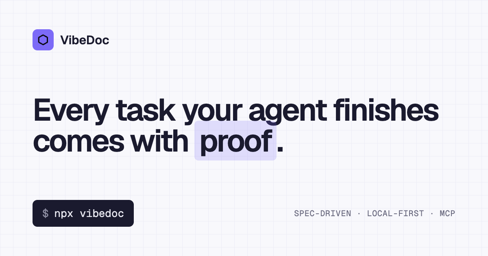
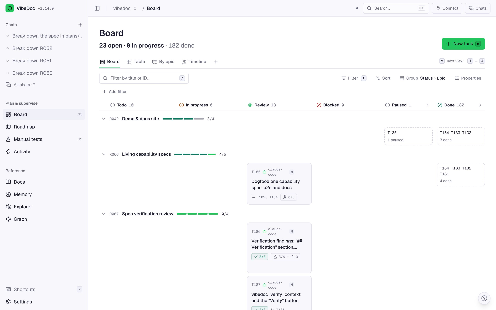
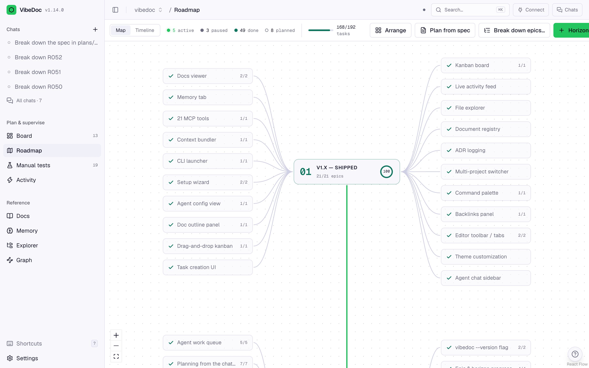
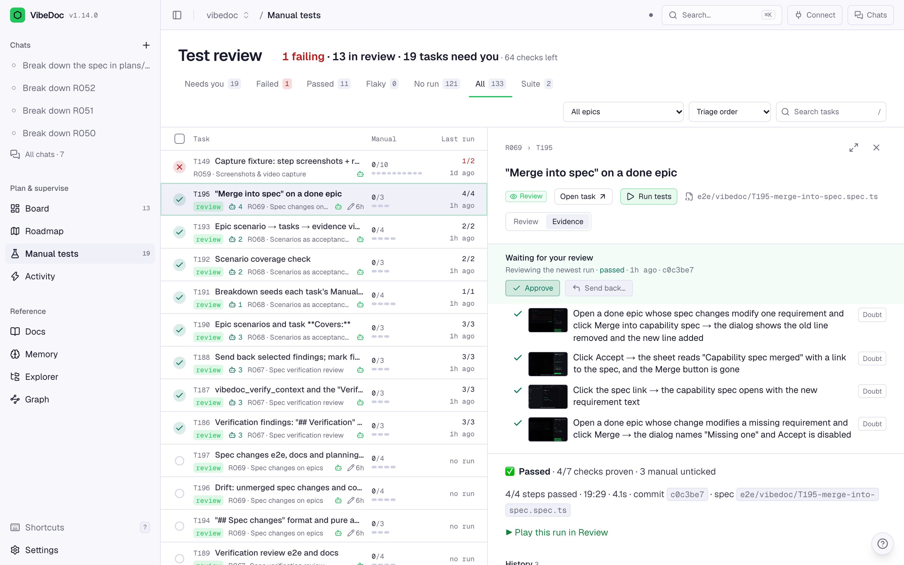
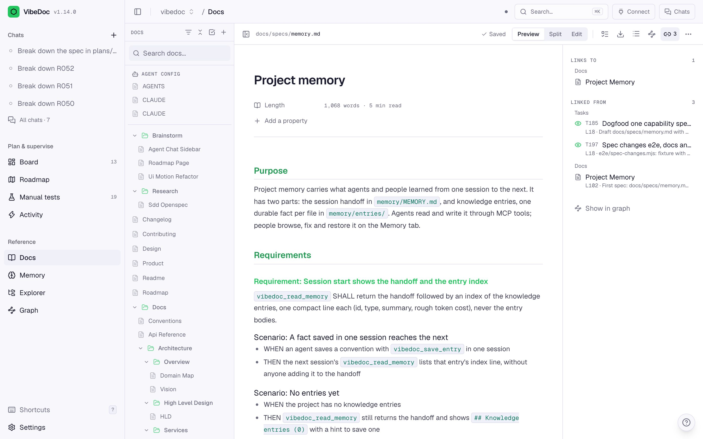
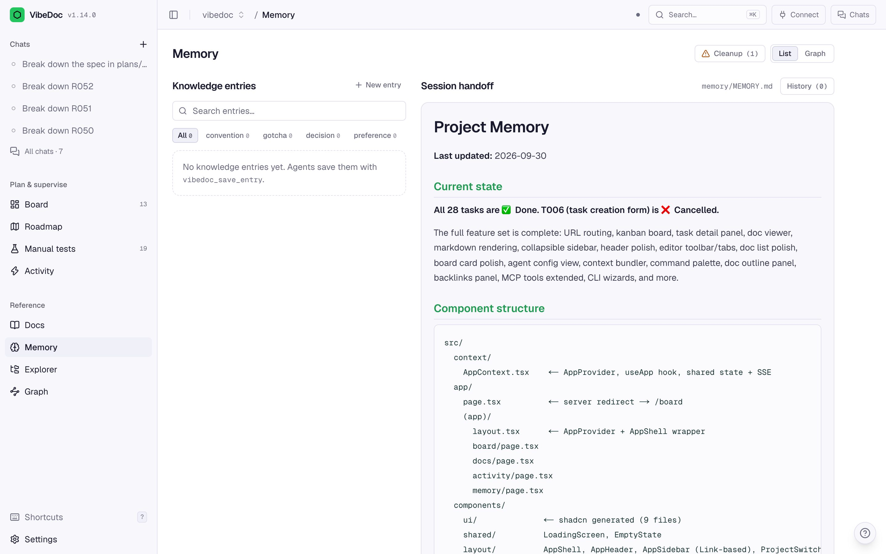
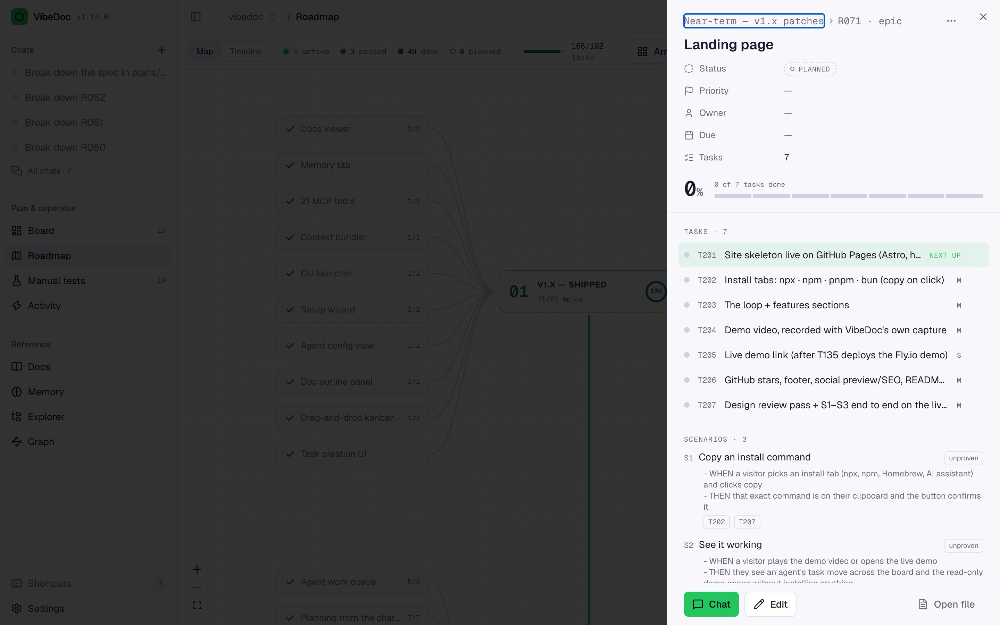
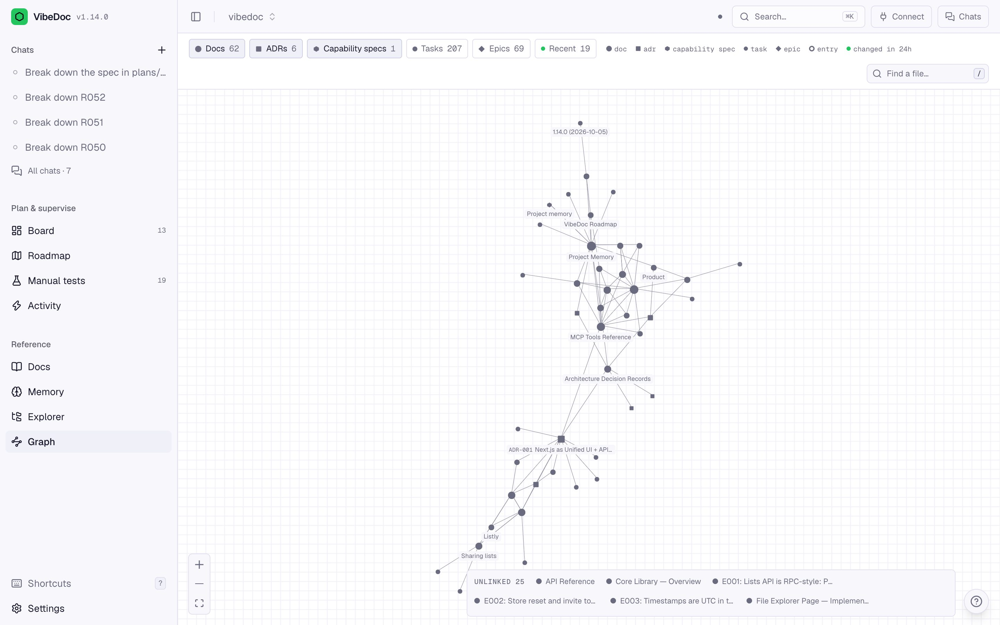

<p align="center">
  <a href="https://quanghoangf.github.io/vibedoc/"></a>
</p>

<p align="center">
  <b>Spec-driven development for AI coding agents.</b><br>
  Your plan, specs and memory live as markdown in your repo. Claude Code, Cursor or any MCP agent works them task by task,<br>
  and you review each task on its tests, screenshots and video.
</p>

<p align="center">
  <a href="https://www.npmjs.com/package/vibedoc"></a>
  <a href="https://www.npmjs.com/package/vibedoc"></a>
  <a href="https://github.com/quanghoangf/vibedoc/actions/workflows/ci.yml"></a>
  <a href="./LICENSE"></a>
  <a href="https://github.com/quanghoangf/vibedoc/stargazers"></a>
</p>

<p align="center">
  <a href="https://quanghoangf.github.io/vibedoc/"><b>Website</b></a> ·
  <a href="https://quanghoangf.github.io/vibedoc/docs/"><b>Docs</b></a> ·
  <a href="https://quanghoangf.github.io/vibedoc/docs/tools/"><b>MCP tools</b></a> ·
  <a href="https://quanghoangf.github.io/vibedoc/changelog/"><b>Changelog</b></a>
</p>

<p align="center">
  
</p>

## Why VibeDoc

AI agents write code fast, then forget. The next session rebuilds context from scratch, "done" is the agent's word for it, and the docs drift until nobody trusts them. VibeDoc gives the agent a home in your repo and gives you the proof:

- **A plan the agent can follow.** Horizons, epics and tasks are markdown files. The agent claims the next ready task, respecting dependencies, and the board moves live in your browser.
- **Proof, not promises.** Each finished task carries a test checklist, a Playwright run with a screenshot per step and a video, and a verdict. Steps that prove nothing are flagged.
- **Specs that stay current.** Capability specs with WHEN/THEN scenarios. Agents see the related requirements when they claim a task, and each epic's spec changes are merged in one reviewed diff.
- **Memory between sessions.** A session handoff plus one-fact knowledge entries, recalled when they matter.

Everything is plain files in your repo. No database, no cloud, no account.

## Quick start

```bash
cd your-project
npx vibedoc
```

VibeDoc opens in your browser and prints its MCP URL. Connect your agent (Claude Code shown; [Cursor, Windsurf and others](https://quanghoangf.github.io/vibedoc/docs/#2-connect-your-agent)):

```bash
npx vibedoc --port 3333                                              # a fixed port keeps the MCP URL stable
claude mcp add --transport http vibedoc http://localhost:3333/api/mcp
```

Then add the skills in Claude Code and plan your first epic:

```text
/plugin marketplace add quanghoangf/vibedoc
/plugin install vibedoc@vibedoc
/vibedoc:roadmap
```

**Rather not read?** Paste [the install prompt](https://quanghoangf.github.io/vibedoc/docs/ai-install/) into your agent: it starts VibeDoc, connects it, adds the skills and reports back.

### Install it

`npx vibedoc` needs nothing installed. To keep a `vibedoc` command:

| Channel | Install | Update | Uninstall |
|---------|---------|--------|-----------|
| npm | `npm install -g vibedoc` | `npm install -g vibedoc@latest` | `npm uninstall -g vibedoc` |
| pnpm | `pnpm add -g vibedoc` | `pnpm add -g vibedoc@latest` | `pnpm remove -g vibedoc` |
| bun | `bun add -g vibedoc` | `bun add -g vibedoc@latest` | `bun remove -g vibedoc` |
| Homebrew (macOS, Linux) | `brew install quanghoangf/vibedoc/vibedoc` | `brew upgrade vibedoc` | `brew uninstall vibedoc` |
| No Node (macOS, Linux) | `curl -fsSL https://quanghoangf.github.io/vibedoc/install.sh \| sh` | same with `sh -s -- --update` | same with `sh -s -- --uninstall` |
| No Node (Windows) | `irm https://quanghoangf.github.io/vibedoc/install.ps1 \| iex` | run it again | [see the docs](https://quanghoangf.github.io/vibedoc/docs/) |

Every channel serves the same version. Check with `vibedoc --version`. Needs Node.js 20.9+ (Homebrew and the one-line installer bring their own).

## How it works

Four commands, one loop. They ship as a Claude Code plugin; in Cursor or any MCP client the same steps are the `vibedoc_*` tools.

| Step | Command | What happens |
|---|---|---|
| **Plan** | `/vibedoc:roadmap` | Reads your docs, interviews you about users and goals, writes horizons and epics with scenarios. |
| **Break down** | `/vibedoc:breakdown R004` | Splits an epic into tasks an agent can pick up cold: scope, files, acceptance criteria, verify commands. |
| **Build and prove** | `/vibedoc:work R004` | Claims the next ready task, builds it, runs its checks and a Playwright spec, commits, and repeats. |
| **Review** | `/vibedoc:next` | You approve on the evidence or send findings back; `next` tells you the most useful thing to do now. |

```
your browser  →  http://localhost:<port>          board, roadmap, docs, test review, memory
your agent    →  http://localhost:<port>/api/mcp  45 MCP tools, same files, same live state
```

## Features

<table>
  <tr>
    <td width="50%" valign="top">
      <br>
      <b>Roadmap</b><br>Horizons and epics on a map or a timeline, with progress, due dates and drift (overdue, at risk, uncovered scenarios) worked out from the files.
    </td>
    <td width="50%" valign="top">
      <br>
      <b>Evidence</b><br>Each checklist item next to the step that proved it: screenshot, video, verdict, history. Re-run any task, or the whole regression suite, from the browser.
    </td>
  </tr>
  <tr>
    <td width="50%" valign="top">
      <br>
      <b>Capability specs</b><br>One spec per capability with WHEN/THEN scenarios. Agents get the related requirements on claim; a verifying agent checks the diff against them.
    </td>
    <td width="50%" valign="top">
      <br>
      <b>Memory</b><br>The session handoff and one-fact entries (conventions, gotchas, decisions), with search, history and import from Claude Code's own memory.
    </td>
  </tr>
  <tr>
    <td width="50%" valign="top">
      <br>
      <b>Scenarios as acceptance tests</b><br>An epic's promise as numbered scenarios. Every task says which ones it covers, and the epic shows each as passed, failed or unproven.
    </td>
    <td width="50%" valign="top">
      <br>
      <b>Link graph</b><br>Docs, tasks, epics, specs and entries joined by the links in their text. Broken and stale links stand out.
    </td>
  </tr>
</table>

Also: an agent chat inside the app that plans with you and proposes edits as diffs, live activity and session history, saved board views, and a docs editor with live collaboration.

## Recommended CLAUDE.md snippet

The skills do this for you in Claude Code. For other agents, add this to the project's `CLAUDE.md` / `AGENTS.md`:

```markdown
## Session protocol
- Start: `vibedoc_read_memory` (last session's handoff), then `vibedoc_get_status`.
- Work an epic: `vibedoc_next_task { epic: "R004" }` claims the next ready task with its full spec; build it, run its Verify block,
  then `vibedoc_update_task <id> done` with a manual test checklist. Repeat until the epic is finished or needs a human.
- Decisions: `vibedoc_log_decision` writes an ADR. Lasting facts: `vibedoc_save_entry`.
- End: `vibedoc_update_memory` with the handoff for the next session.
```

Every tool, with its parameters: [MCP tool reference](https://quanghoangf.github.io/vibedoc/docs/tools/).

## Your files

VibeDoc reads the folder you start it in and shows what it finds. Nothing is required up front.

```
your-project/
├── plans/roadmap/R004-billing.md   horizons and epics (scenarios, spec changes)
├── plans/tasks/T031-checkout.md     one task per file: status, deps, spec, checklist
├── docs/specs/billing.md            capability specs
├── docs/**/*.md                     your docs, ADRs in docs/architecture/decisions/
└── memory/MEMORY.md, entries/       session handoff and knowledge entries
```

VibeDoc's own state stays small and readable: `.vibedoc-activity.json` (the activity log) and `.vibedoc/` (settings, saved views, chats). Test runs go to `~/.vibedoc/runs/`, outside the repo.

## Development

```bash
git clone https://github.com/quanghoangf/vibedoc.git
cd vibedoc
pnpm install
VIBEDOC_ROOT=/path/to/a/project pnpm dev
```

Next.js 16 (App Router) · Tailwind CSS 4 · MCP over HTTP JSON-RPC (`/api/mcp`) · Server-Sent Events · the file system as the only store. The landing page and docs are in [`site/`](site/) (Astro + Starlight).

Pull requests are welcome: see [CONTRIBUTING.md](./CONTRIBUTING.md) for the architecture rules and commit conventions, and open an [issue](https://github.com/quanghoangf/vibedoc/issues/new/choose) for bugs and ideas.

## License

[MIT](./LICENSE)
