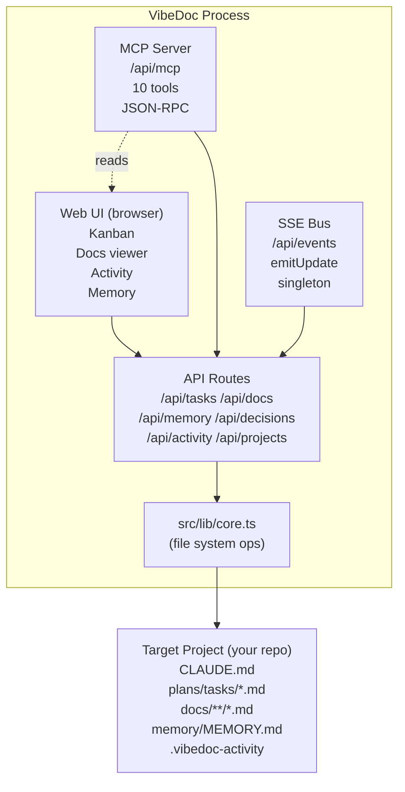

# Domain Map
**Last updated:** 2025-02-28

## Bounded contexts

## Data ownership
| Domain | Owner | Storage | Format |
|--------|-------|---------|--------|
| Tasks | Target project | `plans/tasks/T*.md` | Markdown with frontmatter-style `**Key:** Value` |
| Docs | Target project | `docs/**/*.md` | Markdown |
| Memory | Target project | `memory/MEMORY.md` | Markdown |
| ADRs | Target project | `docs/architecture/decisions/ADR-*.md` | Markdown |
| Activity log | Target project | `.vibedoc-activity.json` | JSON array (500 events max) |
| Project config | VibeDoc env | `.env.local` | `VIBEDOC_ROOT=<path>` |

## Key relationships
- **Web UI ↔ API Routes:** Browser fetches `/api/*` and subscribes to `/api/events` (SSE)
- **MCP Server ↔ API Routes:** MCP handler calls same `core.ts` functions as API routes — no duplication
- **API Routes → SSE Bus:** After every mutation, API route calls `emitUpdate()` → browser refreshes
- **core.ts ↔ File System:** Single module owns all file I/O. Everything else imports from it.
