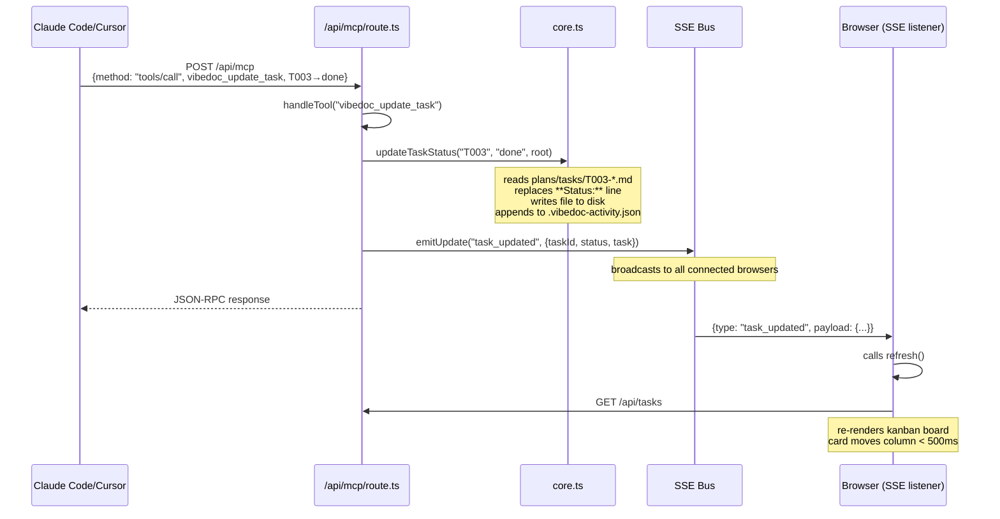
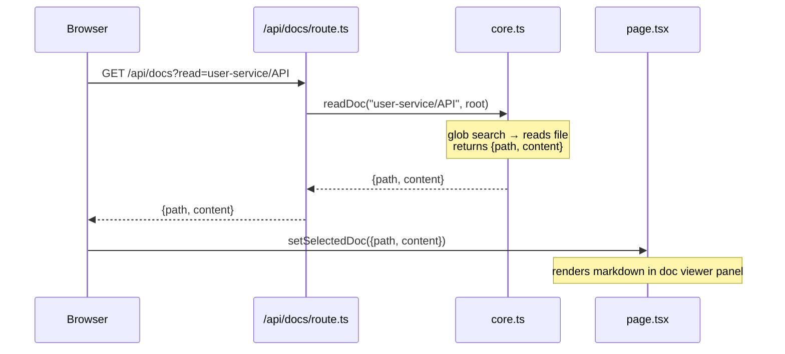
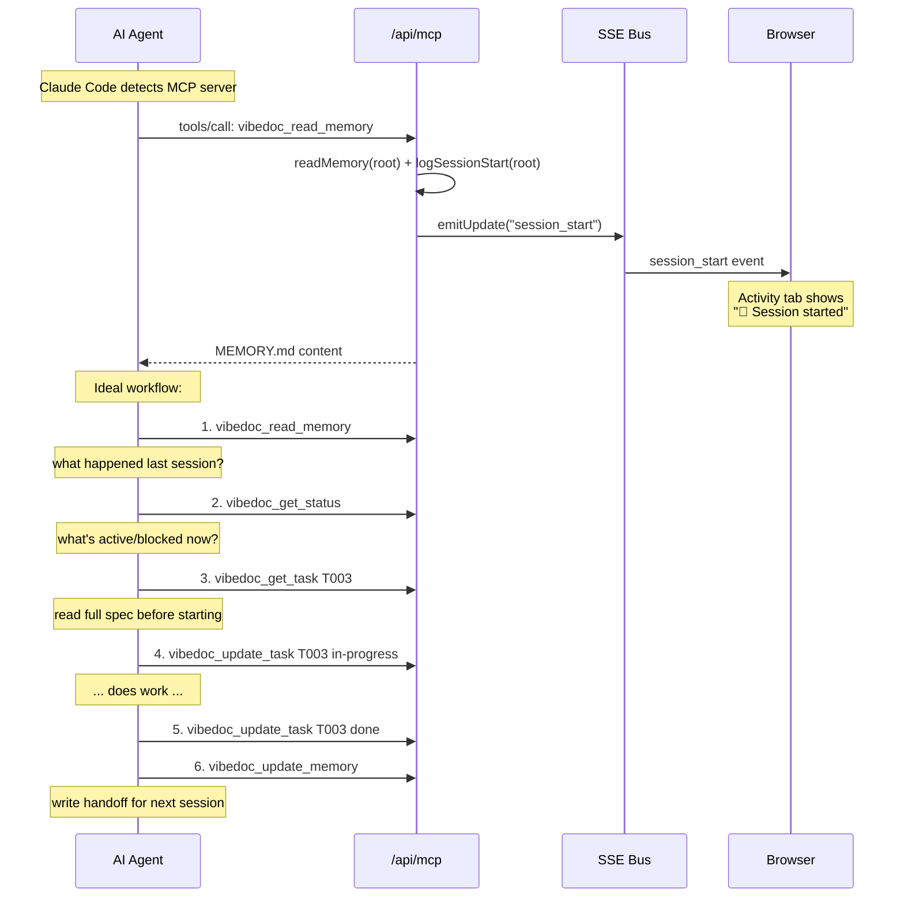

# High-Level Design
**Last updated:** 2025-02-28

## Request flows

### AI agent moves a task (the core loop)


### Human opens a doc


### AI starts a session


## Component responsibilities

### `src/lib/core.ts`
The only file that touches the file system. Every read/write goes through here.
- `findRoot()` / `getConfiguredRoot()` — project root detection
- `listDocs()` / `readDoc()` / `searchDocs()` — doc operations
- `listTasks()` / `getTask()` / `updateTaskStatus()` — task operations
- `readMemory()` / `updateMemory()` — session memory
- `logDecision()` — ADR creation
- `readActivity()` / `appendActivity()` — activity log
- `getProjectSummary()` — combined status (used by dashboard)

### `src/lib/events.ts`
Singleton SSE event bus. Lives in the Node.js process.
```
emitUpdate(type, payload) → all connected SSE clients receive it
```
All API routes call `emitUpdate()` after mutations. Never call from `core.ts`.

### `src/app/api/mcp/route.ts`
Hand-rolled JSON-RPC 2.0 MCP handler. **No MCP SDK stdio transport** (incompatible with Next.js).
Registers 10 tools. Each tool calls `core.ts` functions directly.

### `src/app/page.tsx`
Single client component. Manages all UI state with `useState`. Fetches from API routes.
SSE subscription in `useEffect` — refreshes relevant data on each event type.
