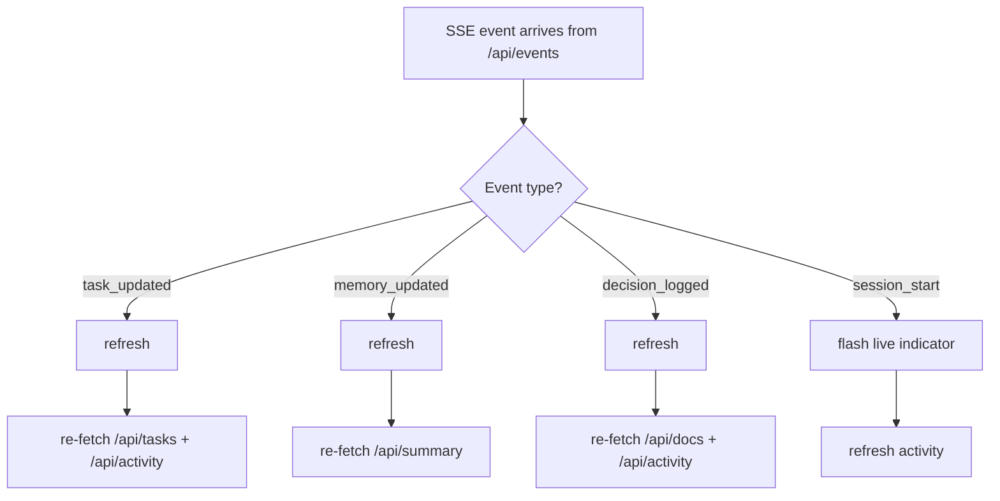

# Web UI — Overview
**File:** `src/app/page.tsx`
**Last updated:** 2025-02-28

## Tabs

| Tab | Component | Data source | Real-time? |
|-----|-----------|-------------|-----------|
| Board | `TaskCard` grid | `/api/tasks` | ✅ SSE |
| Docs | Doc list + markdown viewer | `/api/docs` | ❌ |
| Activity | Timeline feed | `/api/activity` | ✅ SSE |
| Memory | MEMORY.md renderer | `/api/summary` | ✅ SSE |

## State management
Single `page.tsx` client component. All state in `useState`.
No external state library (Redux, Zustand, etc.) — not needed at this scale.

```typescript
// Key state
const [board, setBoard] = useState<TaskBoard | null>(null)
const [docs, setDocs] = useState<DocFile[]>([])
const [selectedDoc, setSelectedDoc] = useState<{path, content} | null>(null)
const [activity, setActivity] = useState<ActivityEvent[]>([])
const [summary, setSummary] = useState<Summary | null>(null)
```

## Real-time flow


## Current features (v0.1)
- ✅ Kanban board — 4 columns (in-progress, todo, blocked, done)
- ✅ Task cards — hover to reveal quick status actions
- ✅ Doc browser — file tree sidebar + markdown viewer
- ✅ Doc search — full-text via `/api/docs?q=`
- ✅ Activity feed — timeline with AI/human badge
- ✅ Memory tab — renders MEMORY.md
- ✅ Project switcher — multi-project dropdown
- ✅ Live indicator — pulses on SSE events
- ✅ MCP endpoint display in header

## Planned (see plans/tasks/)
- ⬜ Drag-and-drop kanban columns
- ⬜ Inline doc editor
- ⬜ ADR creation form (currently AI-only via `vibedoc_log_decision`)
- ⬜ Task creation UI
- ⬜ Session start/end buttons (call MCP tools from UI)
- ⬜ Dark/light theme toggle
- ⬜ Keyboard shortcuts (k=kanban, d=docs, a=activity, m=memory)
